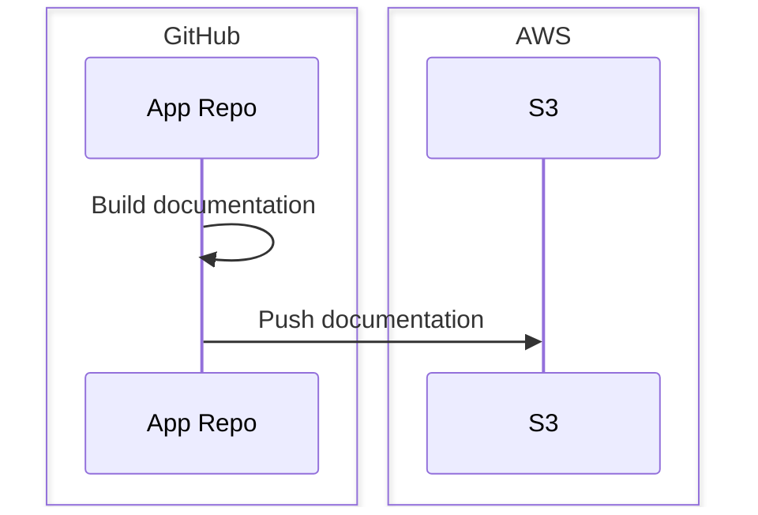

# Documentation Deployment Workflow

To deploy your documentation, a deployment workflow is required. This will be
added to your repository by the DevOps team, via pull request, after your
documentation has been [reviewed and approved][review].

The default deployment workflow is designed to build and push static
documentation generated by [MkDocs]. You may need to update the workflow to
include any additional build steps or dependencies, particularly if you're using
a different documentation system.

## DIY

If you'd like to get a head start on your deployment workflow, you can use the
default workflow template provided below. This template is a YAML file defining
a workflow for GitHub Actions.

Follow the steps below to add the workflow to your repository:

1. Copy the template below
1. Paste the contents into a new file in your repository at
   `.github/workflows/docs.yaml`
1. Add your additional build steps, as needed, before the `Build documentation`
   step
1. Review the workflow for any additional changes you may need to make

## Environment

> [!TIP]
> The DevOps team will create the initial environment for you and set the
> appropriate secrets and variables. You can then modify the environment as
> needed.

For this workflow to function correctly, you will need to set up one or more
environments for it be run against. The environment should include the following
secrets and variables:

### Secrets

| Name                    | Description                                         |
|-------------------------|-----------------------------------------------------|
| `AWS_ACCESS_KEY_ID`     | AWS access key ID with access to the S3 bucket.     |
| `AWS_SECRET_ACCESS_KEY` | AWS secret access key with access to the S3 bucket. |

### Variables

| Name          | Description                                                                                                                         |
|---------------|-------------------------------------------------------------------------------------------------------------------------------------|
| `AWS_REGION`  | The AWS region where the S3 bucket is located.                                                                                      |
| `DOCS_BUCKET` | The name of the S3 bucket where the documentation will be deployed.                                                                 |
| `PREFIX`      | The prefix (subdirectory) in the S3 bucket where the documentation will be deployed. This should match the name from your app spec. |

## How it works

The deployment workflow is designed to automate the process of building and
deploying new versions of your documentation. It does this by:

1. Installing the required dependencies, such as MkDocs and any plugins
1. Building the documentation using MkDocs
1. Syncing the built documentation to an S3 bucket

The following sequence diagram illustrates the flow of the deployment workflow
and how the various components interact during the process:



## Template

```yaml
--8<-- "docs/assets/docs-deployment-workflow.yaml"
```

[mkdocs]: https://www.mkdocs.org/
[review]: usage.md#review-and-setup
