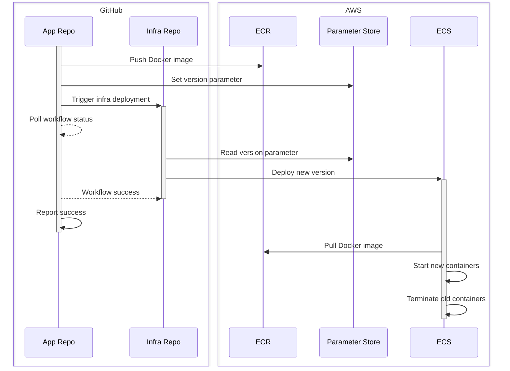

# Shared Hosting Deployment Workflow

To deploy an application to the shared hosting environment, a deployment
workflow is required. This will be added to your repository by the DevOps team,
via pull request, after your application has been [reviewed and
approved][review].

The default deployment workflow is designed to build and push the Docker image
for your application, then issue a deployment request to the shared hosting
service. You may need to update the workflow to include any additional build
steps, such as running tests or building static assets.

## DIY

If you'd like to get a head start on your deployment workflow, you can use the
default workflow template provided below. This template is a YAML file defining
a workflow for GitHub Actions.

Follow the steps below to add the workflow to your repository:

1. Copy the template below
1. Paste the contents into a new file in your repository at
   `.github/workflows/deploy.yaml`
1. Update the `APPLICATION` environment variable to match your application's
   name; this should match the name of your app spec file, without the
   `.yaml` extension (e.g. `my-app.yaml` would be `my-app`)
1. Add your additional build steps, as needed, before the
   `Build and push Docker image` step

## Environment

> [!TIP]
> The DevOps team will create the initial environment for you and set the
> appropriate secrets and variables. You can then modify the environment as
> needed.

For this workflow to function correctly, you will need to set up one or more
environments for it be run against. The environment should include the following
secrets and variables:

### Secrets

| Name                    | Description                                                           |
|-------------------------|-----------------------------------------------------------------------|
| `AWS_ACCESS_KEY_ID`     | AWS access key ID with access to the shared services environment.     |
| `AWS_SECRET_ACCESS_KEY` | AWS secret access key with access to the shared services environment. |

### Variables

| Name         | Description                                                      |
|--------------|------------------------------------------------------------------|
| `AWS_REGION` | The AWS region where the shared services environment is located. |

## How it works

The deployment workflow is designed to automate the process of building and
deploying new versions of your application. It does this by:

1. Building a new Docker image for your application
1. Tagging the image as a new version[^1]
1. Pushing the image to Elastic Container Registry (ECR)
1. Setting the new version in AWS Systems Manager (SSM) Parameter Store
1. Triggering a deployment in the shared services infrastructure repository for
   the specific application and environment, which will handle deploying the
   new version to Elastic Container Service (ECS)
1. Waiting for the deployment to complete
2. Reporting success[^2]

The following sequence diagram illustrates the flow of the deployment workflow
and how the various components interact during the process:



## Template

```yaml title=".github/workflows/deploy.yaml"
--8<-- "docs/assets/app-deployment-workflow.yaml"
```

[review]: usage.md#review-and-setup

[^1]: By default, the new version is based on the latest SHA. You may want to
      update this match the versioning scheme used by your application.
[^2]: Success/failure is reported as the job status in GitHub Actions.
      You can also add additional steps to notify your team via Slack,
      PagerDuty, or other means.
