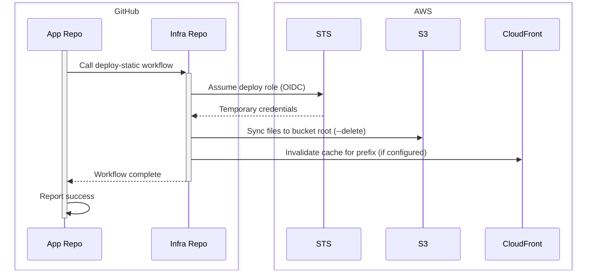

# Static App Deployment Workflow

Static apps deploy via a reusable GitHub Actions workflow defined in this
repository. Your application repository calls that workflow rather than
implementing its own deploy logic. This means deploy behavior — S3 sync
flags, cache invalidation, credential handling — is managed centrally and
picked up automatically on your next deploy.

## Setup

Add a workflow file to your repository at `.github/workflows/deploy.yaml`
using the template in the [Template](#template) section below. No
customization is required unless your static files live in a subdirectory
(see [inputs](#inputs)).

## Secrets and variables

> [!TIP]
> The DevOps team configures the secrets and variables listed below after your
> app spec is merged. You do not need to set them yourself.

### Secrets

| Name                  | Description                                       |
| --------------------- | ------------------------------------------------- |
| `AWS_STATIC_ROLE_ARN` | ARN of the IAM role assumed to write files to S3. |

### Variables

| Name                         | Description                                                                                                                                           |
| ---------------------------- | ----------------------------------------------------------------------------------------------------------------------------------------------------- |
| `STATIC_BUCKET`              | Name of your app's dedicated S3 bucket (e.g. `static-apps-development-my-app`).                                                                       |
| `STATIC_PREFIX`              | Your app's URL path segment (e.g. `my-app`). Used only for CloudFront cache invalidation — not an S3 key prefix. Files are synced to the bucket root. |
| `CLOUDFRONT_DISTRIBUTION_ID` | CloudFront distribution ID. If set, the cache for your app's path is invalidated on each deploy.                                                      |
| `AWS_REGION`                 | AWS region. Defaults to `us-east-1` if not set.                                                                                                       |

## Inputs

The reusable workflow accepts two optional inputs:

| Input         | Default       | Description                                                                                                                         |
| ------------- | ------------- | ----------------------------------------------------------------------------------------------------------------------------------- |
| `environment` | `development` | The GitHub environment to deploy to.                                                                                                |
| `source_dir`  | `.`           | Local directory to sync, relative to the repo root. Set this if your static files live in a subdirectory (e.g. `dist` or `public`). |

Pass inputs via the `with:` block in your workflow:

```yaml
jobs:
  deploy:
    uses: codeforamerica/shared-services-infra/.github/workflows/deploy-static.yml@main
    with:
      environment: ${{ inputs.environment || 'development' }}
      source_dir: dist
    secrets: inherit
```

## How it works

The deployment workflow is intentionally minimal. It does three things:

1. Assumes the deploy IAM role via OIDC (no long-lived AWS credentials in
   your repository)
1. Syncs your files to the app's dedicated S3 bucket root using `aws s3 sync
   --delete`; files removed from your repository are removed from S3
1. Optionally invalidates the CloudFront cache for your prefix so users see
   the new version immediately

`.git/` and `.github/` directories are excluded from the sync automatically.

The following sequence diagram shows the flow:



## Template

```yaml title=".github/workflows/deploy.yaml"
--8<-- "docs/assets/static-deployment-workflow.yaml"
```

[review]: usage.md#review-and-setup
